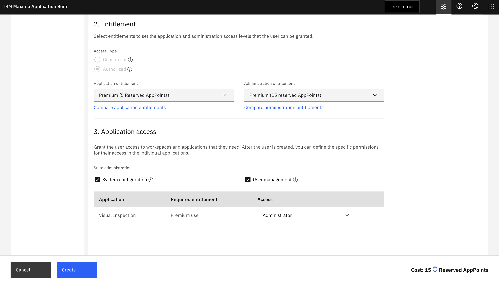

# MVI on Satellite Deployer

This project is based on IBM Cloud Pak Deployer https://github.com/IBM/cloud-pak-deployer  
It was stripped down before satellite specific components weere added (still holds many unused artifacts). If time permits we intend to submit satellite components upstream. Credits to the developers of Cloud Pak Deployer.

The following steps will install Maximo Visual Inspection on an OpenShift cluster managed by IBM Cloud Satellite. For the purpose of this lab, the satellite location is hosted on IBM Cloud VPC.

<p align="center"></p>

## 1 Prereqs
- podman installed
- on MacOS make sure to have mounted home folders, i.e.
```bash
podman machine init --cpus=4 --memory=4096 -v $HOME:$HOME
```
- publicly accessable qcow image to RHCOS. e.g. cos://eu-de/images-mvi-on-sat/rhcos-4.10.37-x86_64-ibmcloud.x86_64.qcow2
- resource group should exist

- [prepare ibm cloud account](prerequisites.md)

## 2 Prepare
- make sure podman is installed
- build the container:
```bash
  ./sat-deploy.sh build
```
- copy sample-configurations/sat-ibm-cloud-roks to some folder
```bash
  mkdir -p data/config/sample
  mkdir -p data/status/sample
  cp -r ./sample-configurations/sat-ibm-cloud-roks/* data/config/sample
```
- update resource_group in data/config/sample/config/sat-ibm-cloud-roks.yaml
- update href for custom_image in data/config/sample/config/sat-ibm-cloud-roks.yaml
- update ibm_cloud_region in data/config/sample/inventory/sample.inv
- update ibm_cloud_location (for satellite) in data/config/sample/inventory/sample.inv

## 3 Create satellite + OpenShift cluster

```bash
export STATUS_DIR=$(pwd)/data/status/sample
export CONFIG_DIR=$(pwd)/data/config/sample
export IBM_CLOUD_API_KEY=*****
export IBM_ODF_API_KEY=*****
export ENV_ID=xy-mvi5  # update

./sat-deploy.sh env apply -e env_id="${ENV_ID}" -e IBM_ODF_API_KEY="${IBM_ODF_API_KEY}" -v
```

If you want to open the OpenShift console at this stage, connect to the private network of your Satellite Location using the wireguard configuration file found in:
```code
data/status/sample/downloads/client.conf
```

## 4 Configure OpenShift Data Foundation(ODF)

This is done by the automation. For background information checkout ui-docs.

### TODO link info

## 5 Activate OpenShift registry

This is done by the automation. For background information checkout ui-docs.

### TODO link info

## 6 Add a GPU node to the environment

Edit configuration file data/config/sample/config/sat-ibm-cloud-roks.yaml and uncomment gpu node in section sat_host.
Stay in the same shell as before, then requirement variables are still set. Execute the following apply command. Note
that due to limited capacity of GPU instances this command may fail. If it fails, try a different zone.

```bash
./sat-deploy.sh env apply -e env_id="${ENV_ID}" -v --confirm-destroy
```

### Deploy the Nvidia GPU operator

Start a shell in the deployment container:
```bash
./sat-deploy.sh env cmd -e ENV_ID="${ENV_ID}"
```
You should have an command prompt inside the docker container, which contains all CLIs like ibmcloud and oc.
Connect to your Cloud Account and Openshift cluster:
```bash
ibmcloud login --apikey $IBM_CLOUD_API_KEY --no-region
ibmcloud oc cluster config --admin -c "${ENV_ID}-sat-roks"

```

```bash
ROLE_NAME=nvidia_gpu ansible-playbook ibm.mas_devops.run_role
```

### GPU operator fix
The automation fixes the following issue https://github.com/NVIDIA/gpu-operator/issues/428.

## 7 Install Maximo core

- Copy Maximo configuration files:

```bash
  mkdir -p data/status/sample/mvi
  cp -r ./sample-configurations/mvi/* data/status/sample/mvi

```
- Edit and complete data/status/sample/mvi/masEnv.sh 
Look for all parametes in brackets \<param>

- Run the automation playbook. cmd container should be still running. If not start again and login to OpenShift.

```bash
source /data/status/mvi/masEnv.sh
ansible-playbook ibm.mas_devops.oneclick_core

```

- Take a note of the superuser name and password displayed at the end of the playbook.

## 8 Install MVI

```bash
source /data/status/mvi/masEnv.sh
ansible-playbook ibm.mas_devops.oneclick_add_visualinspection

```

Currently MVI does not support ODF but a fix is on the way. In the meantime we use this workaround:

```bash
oc patch scc ibm-mas-visualinspection-scc \
    --type='json' \
    --patch='[
        {"op": "replace", "path": "/seLinuxContext/type", "value": "MustRunAs"}
    ]'
```

Trigger recreation of MVI pods

```bash
oc delete pod -n mas-inst1-visualinspection --all
```

Wait until all pods have been recreated. The pvc task pod is expected to fail after the patch. The job did complete before the patch.

```bash
oc get pod -n mas-inst1-visualinspection
```


## 9 Login as superuser and create admin user

- Using the superuser credentials that were created upon successful installation to login to MAS UI ```https://admin.maximo.<your-domain>.com```

- Go to ```Administration``` > ```Users``` to create a new admin user (15 AppPoints) and fill in the details for the user like name, email and password.

- Create admin user

- Assign application and administration ```entitlements``` -> ```Premium```

- Save the credentials, logout of the super user and login with the new admin user created to confirm access to the platform.

## 10 Expose MAS to the internet

- Edit configuration file data/config/sample/config/sat-ibm-cloud-roks.yaml and uncomment the loadbalancer.
- Run the following command:

```bash
./sat-deploy.sh env apply -e env_id="${ENV_ID}" -v
```

## 11 Load demo model and conect MVI mobile


## 12 Destroy artifacts

If the command fails due to some reason (timeout), start it again.

```bash
./sat-deploy.sh env destroy -e env_id="${ENV_ID}" --confirm-destroy
```
