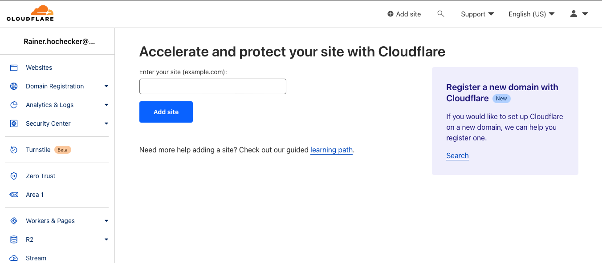
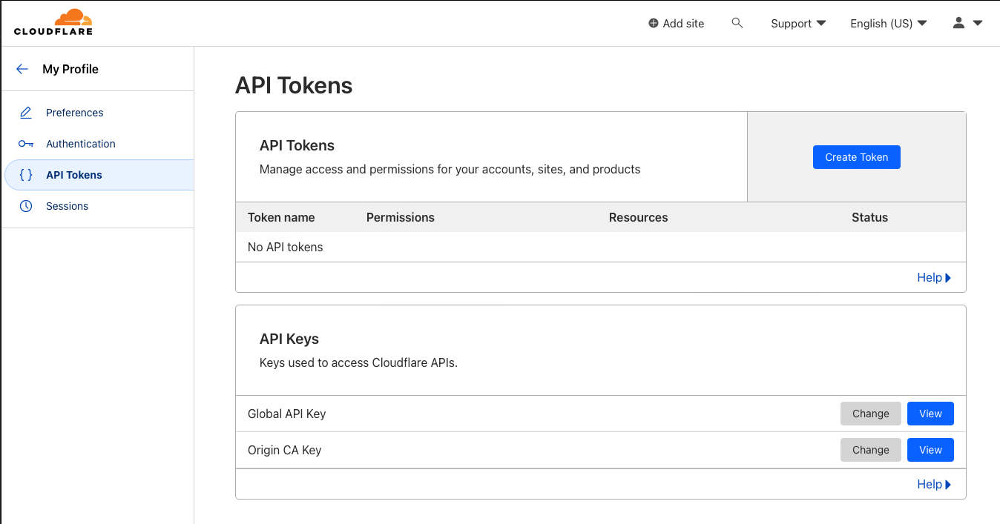
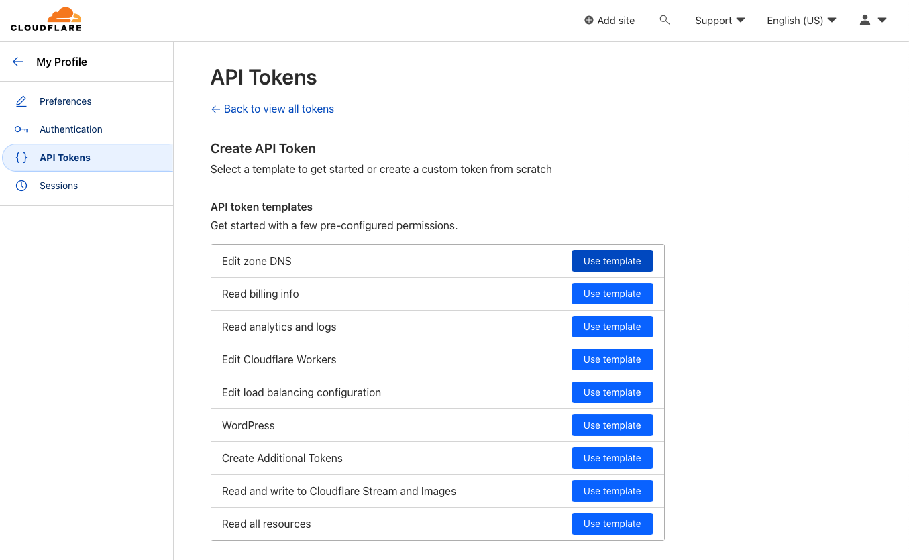
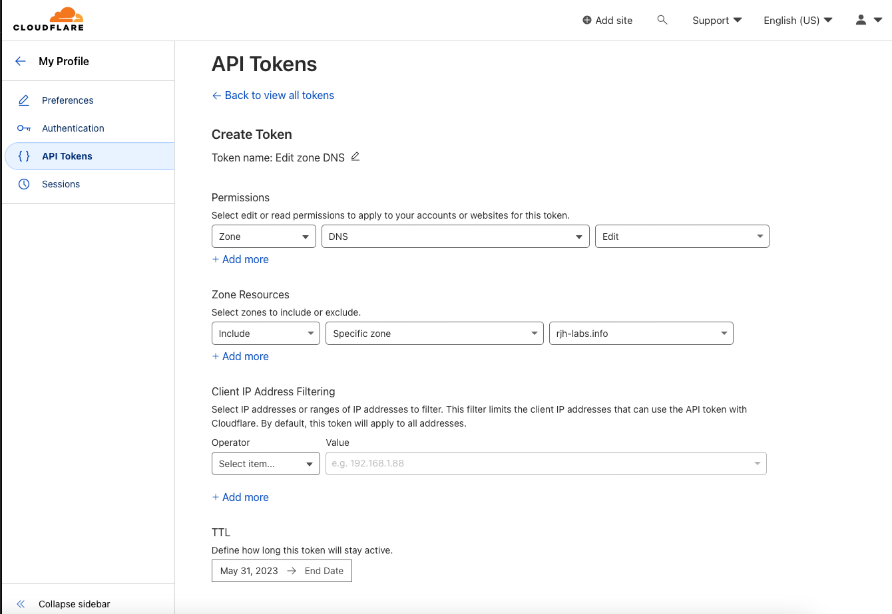

# Preparation Steps

## Create new IBM Cloud Resource Group
As Account Owner create an IBM Cloud Resource Group in the account management, in our example and screenshots we use "mvi-on-sat"

## Create Access Group and access permissions
* Create an IAM Access Group "mvi-on-sat"
* Attach as many users you need to that Group
* Assign the following permissions from the screenshot
<p align="center"></p>

## Create an IAM Service ID for Deployment
* Create an IAM Service ID with the name "sat-deployer"
* Assign the Service ID to the access group "mvi-on-sat"
* Create and save an API Key for that Service ID, this will be our IBM_CLOUD_API_KEY key for deployment

## Reset the IBM Cloud Kubernetes API Key for your region and Resource Group
The deployment automation is using an API Key of the IAM Service ID above to create the Satellite location and OpenShift cluster. To be able to use a Service ID API Key instead a User based API Key we need to reset the IBM Cloud Kubernetes API Key for the *Region and Resource Group* where we target the deployment. See also the doc "[Understanding how the API key works](http://ibm.biz/api-key)".
```bash
# login with a user which has super power in the IBM Cloud Account 
ibmcloud login --sso
# target the right resource group and region
ibmcloud target -g <YOUR RG> -r <YOUR IBM CLOUD REGION>
# reset the API Key
ibmcloud ks api-key reset --region <YOUR IBM CLOUD REGION>
```

## Create an IAM Service ID for OpenShift Data Foundation (ODF)
* Create an IAM Service ID "odf-local"
* Give the Service ID the following permissions
<p align="center"></p>

* create and save an API Key for that Service ID, this will be used to deploy OpenShift Data Foundation using IBM Cloud Satellite storage templates.


## Domain Name and DNS Server
Maximo Application Suite installation requires you to register a couple of DNS records for the chosen Maximo domain. In most cases, clients already own a domain and have a certificate authoriy in place. You may follow the steps in this section to set up your own domain provided by IBM Cloud or Cloudflare. It might take up to 24 hours to have your domain configurations verified (but in general it is much faster).<br>
- Registering a domain via IBM Cloud is inexpensive, approximately $10 for one year. From the menu on IBM Cloud console, go to Classic infrastructure > Services > Domain Registration.
<p align="center"></p>

- Enter the new domain name in the <b>Domain Name</b> field. Click the <b>Check Availability</b> button to check whether the domain name is available, then click continue to register the domain.
<p align="center"></p>

- Unlock the domain. THis is required if you want another DNS provider like Cloudflare or IBM Cloud Internet Servcies to manage the domain.
<p align="center"></p>

### DNS Hosting Service
The Maximo Application Suite installer currently supports two DNS hosting services, IBM CIS and Cloudflare. Other providers have to be setup manually.
IBM Cloud Internet Services is much more than only a DNS hosting service. It costs appproximately $300 per domain it manages. there is also a 30 day trial version limited to one instance per account. Decide what option you would like to try.

#### Cloud Internet Services (CIS), Option 1
* You could share that CIS instance when deploying multiple environments, because each environment gets its own subdomain
* Create a Service ID "cis" and give it the following permissions for your cis instance:
<p align="center"></p>

* Create and save an API Key for that service ID, we need that key later to create automatically DNS entries during Maximo setup
* From the catalog, search for “internet services” and create free trial or standard service. 
<p align="center"></p>

* Click on Add domain
<p align="center"></p>

* Add your custom domain name.
<p align="center"></p>

* Keep note of the CRN and name servers.
<p align="center"></p>

#### Cloudflare, Option 2
* Create an account at Cloudflare https://www.cloudflare.com
* Click "Add Site" at the top of the screen and add you registered domain.
<p align="center"></p>

* Follow the instruction and take a note of the two name servers you are given.
* Create an API token to be used by the Maximo installer. Got to My Profile - API Tokens and click "Create Token"
<p align="center"></p>

* Choose template "Edit zone DNS"
<p align="center"></p>

* Edit the template like this. Include your zone (custom domain)
<p align="center"></p>

* Click continue and copy your token.

#### Set the custom name servers for the registered domain
* Go back to the domain registration page and replace the name servers with the new ones and associate them to your custom domain.
<p align="center"></p>

* After you configure your registrar or DNS provider, it can take up to 24 hours for the changes to take effect. When it is verified that the specified name servers were configured correctly for your domain or subdomain, the domain's status changes from ```Pending``` to ```Active```.