# Preparation Steps

## Create new IBM Cloud Resource Group
As Account Owner create an IBM Cloud Resource Group in the account management, in our example and screenshots we use "mvi-on-sat"

## Create Access Group and access permissions
* Create an IAM Access Group "mvi-on-sat"
* Attach as many users you need to that Group
* Assign the following permissions from the screenshot
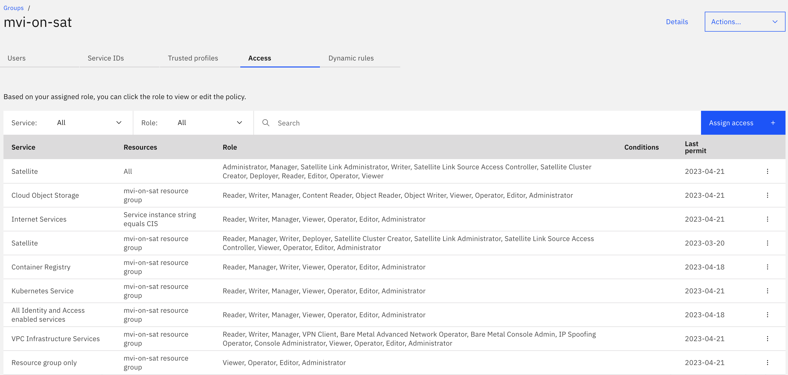

## Create an IAM Service ID for Deployment
* Create an IAM Service ID with the name "sat-deployer"
* Assign the Service ID to the access group "mvi-on-sat"
* Create and save an API Key for that Service ID, this will be our IBM_CLOUD_API_KEY key for deployment

## Create an IAM Service ID for OpenShift Data Foundation (ODF)
* Create an IAM Service ID "odf-local"
* Give the Service ID the following permissions
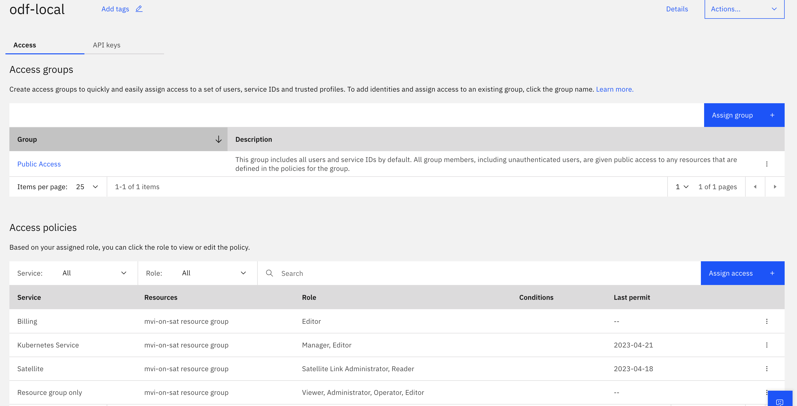
* create and save an API Key for that Service ID, this will be used to deploy OpenShift Data Foundation using IBM Cloud Satellite storage templates.

## Domain Requirements Cloud Internet Services (CIS)
* You need to have configured Cloud Internet Services including a public custom domain
* We will use that CIS Instance for Maximo/MVI to create Domain DNS entries and Letsencrypt certificates.
* You could share that CIS instance when deploying multiple environments, because each environment gets its own subdomain
* Create a Service ID "cis" and give it the following permissions for your cis instance:
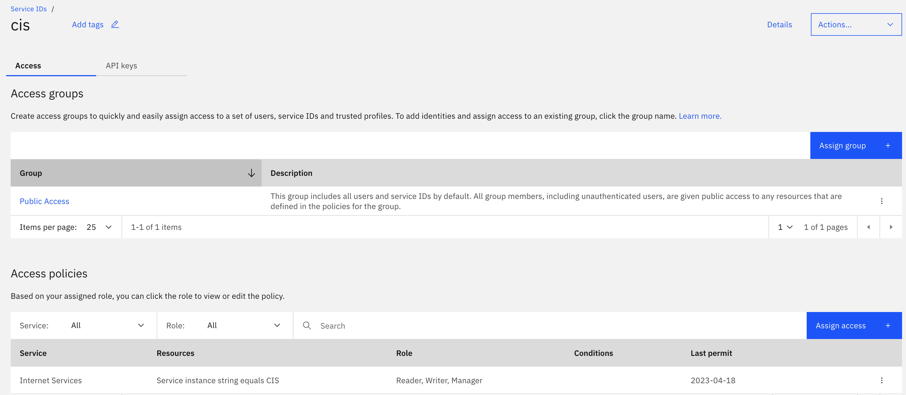
* Create and save an API Key for that service ID, we need that key later to create automatically DNS entries during Maximo setup

## Custom Domain Registration
It's recommended to have a custom domain for the MAS deployment. In most cases, clients already own a domain and have a certificate authoriy in place. You may follow the steps in this section to set up your own domain provided by IBM Cloud. It might take up to 24 hours to have your domain configurations verified.<br>
- To create a custom domain, first you will need to register a new domain with domain name registration service. From the menu on IBM Cloud console, go to Classic infrastructure > Services > Domain Registration.
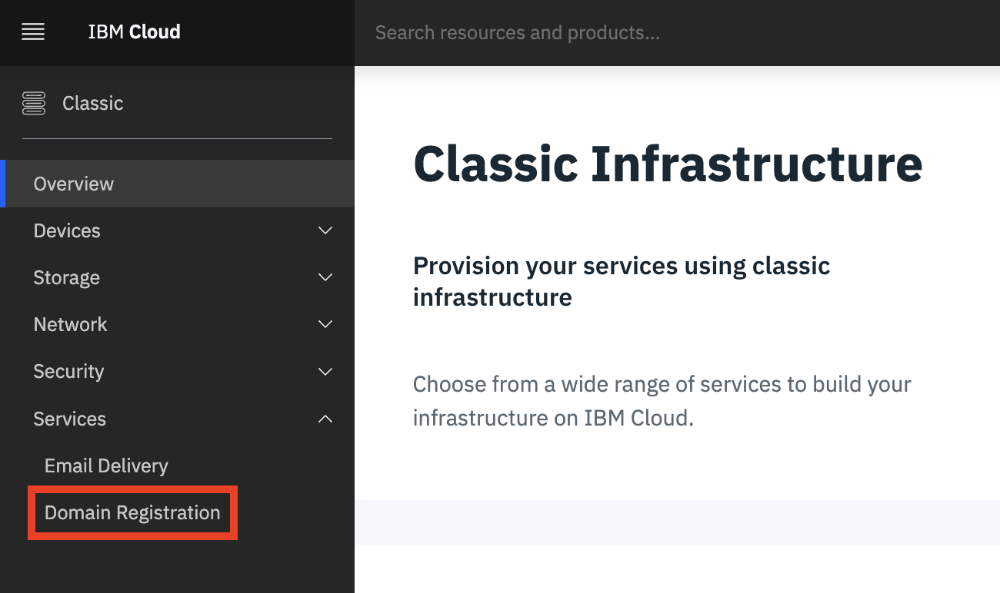

- Enter the new domain name in the <b>Domain Name</b> field. Click the <b>Check Availability</b> button to check whether the domain name is available, then click continue to register the domain.
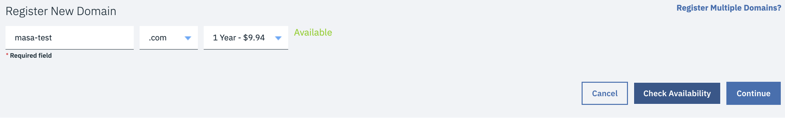

- Unlock the domain.
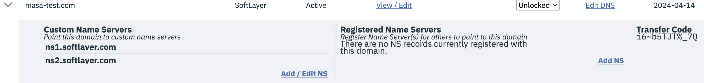

- From the catalog, search for “internet services” and create free trial or standard service. 
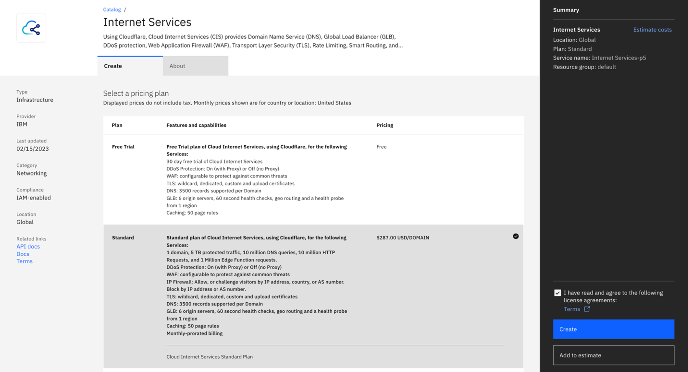
- Click on Add domain
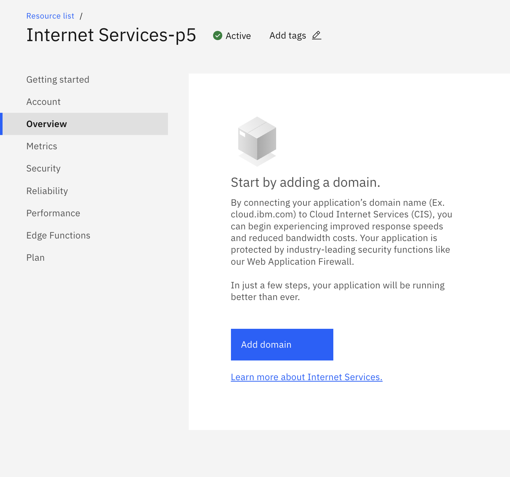
- Add your custom domain name.
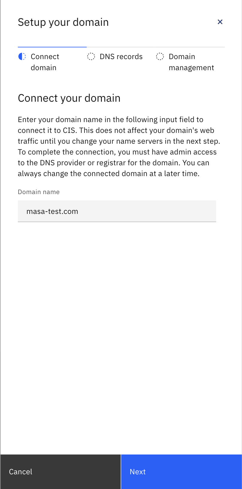
- Keep note of the CRN and name servers.
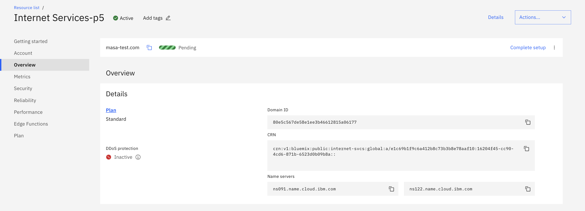
- Go back to the domain registration page and replace the name servers with the new ones and associate them to your custom domain.
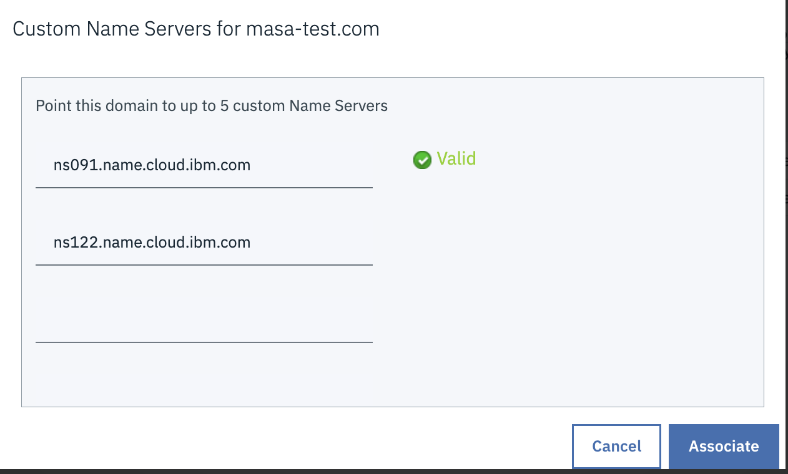
- After you configure your registrar or DNS provider, it can take up to 24 hours for the changes to take effect. When it is verified that the specified name servers were configured correctly for your domain or subdomain, the domain's status changes from ```Pending``` to ```Active```.
