# Manually create and set up GPU host
This section describes the following:
- Creation of GPU VSI
- Installation and set up of the NFD Operator
- Installation and set up of the NVIDIA GPU Operator
- Troubleshooting the daemonset for the NVIDIA GPU Operator
## Create GPU VSI
Maximo Visual Inspection requires a GPU node. For a PoC, you can create single GPU node and add it to the cluster; this is what you will be performing in this step.

### Download the attach host ignition file
- Go to the hosts page in the satellite location, click on attach host and download the ignition script.
<p>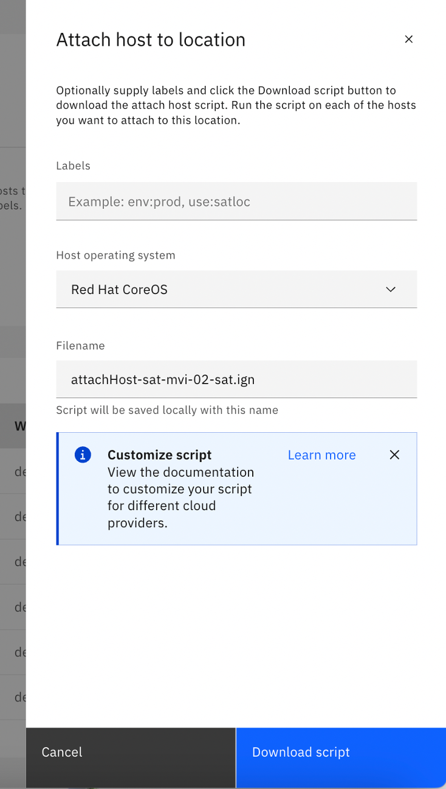</p>

### Create GPU virtual server
-	Go to <b>VPC > virtual server instances</b>
-	Create new virtual server with the custom image that was created when the resources were first provisioned. Select 8x64 profile, add the SSH key that was automatically created during the first provisioning and import the ignition script that was installed earlier.
<p>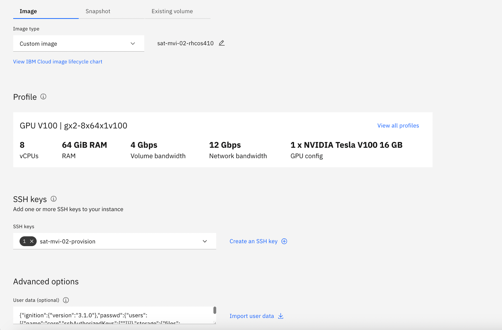</p>

- Once created, you will find the new gpu host attached to the satellite location in a ready/unassigned state.<br>
<p>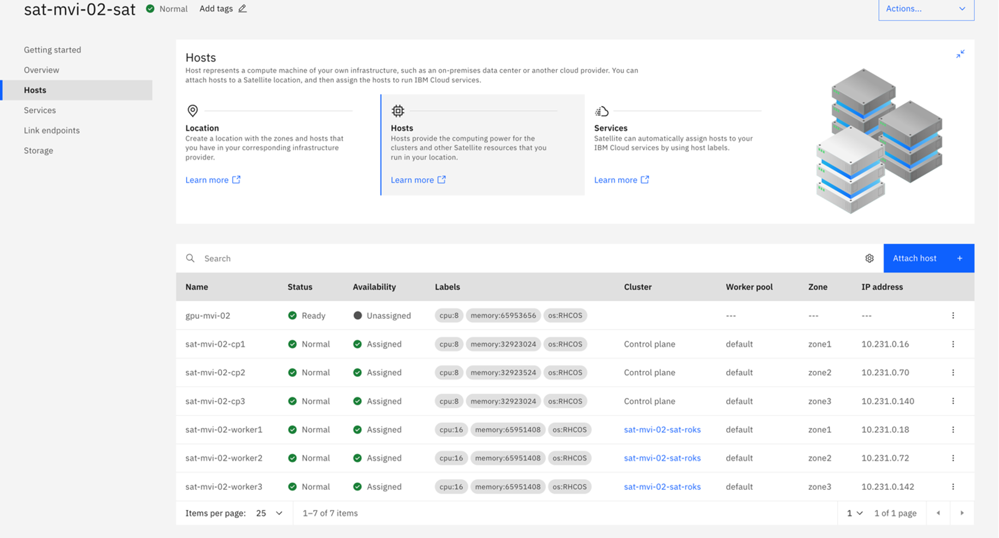</p>

- From the OpenShift cluster overview page, go to ```Worker pools```, and click ```Add``` to create new workerpool for the GPU node.
-	Give the workerpool a unique name, make sure the host operating system is Red Hat CoreOS, and since we will only need 1 GPU node for this lab, select only one zone. Match the flavour of the workerpool to the size of the GPU node and click create.
<p>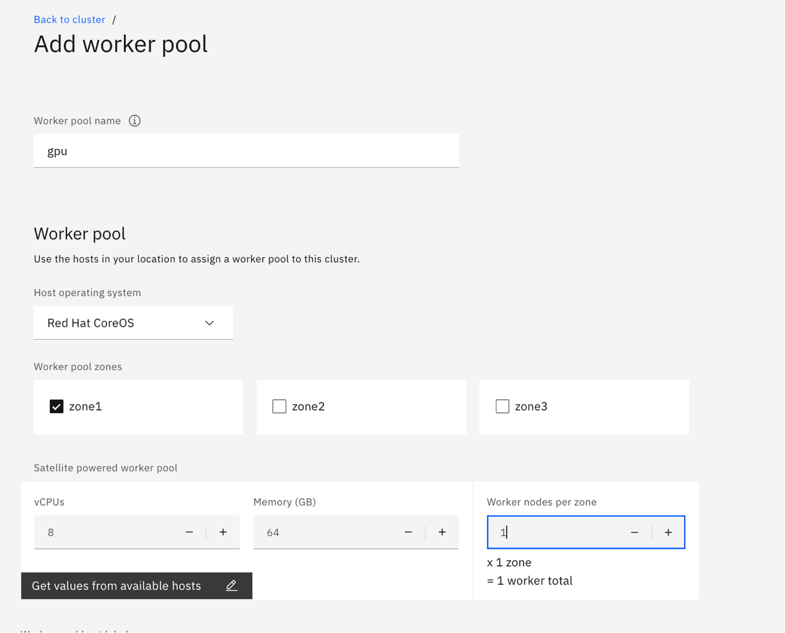</p>

- The newly added GPU node is now in provisioning state, give it few moments till it finishes deploying.
<p>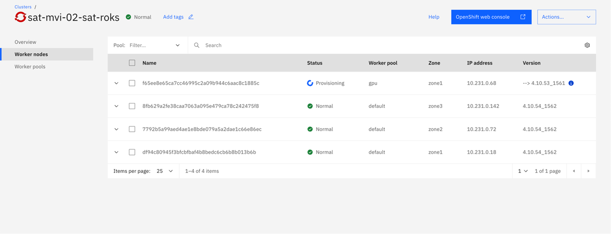</p>

## Install and Set up the Node Feature Discovery (NFD) Operator
- Search for the node feature discovery operator and select the Red Hat certified operator.
<p>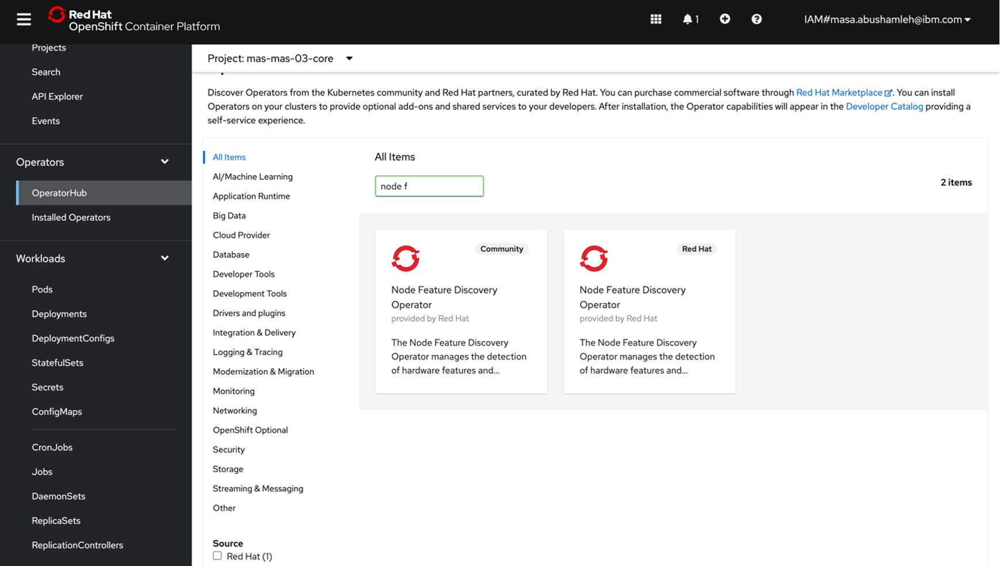</p>

- keep the default settings, the operator should be installed in ```openshift-nfd``` project.
<p>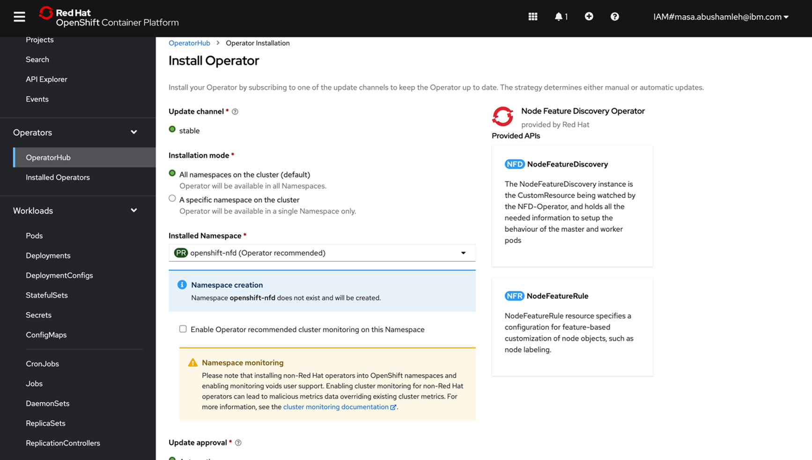</p>

- Verify the Node Feature Discovery Operator is running:
```
oc get pods -n openshift-nfd
NAME                                      READY   STATUS    RESTARTS   AGE
nfd-controller-manager-6b8946457b-jwf67   2/2     Running   0          11m
```

- Once the operator is successfully installed, go to the overview page and create an instance of NodeFeatureDiscovery
<p>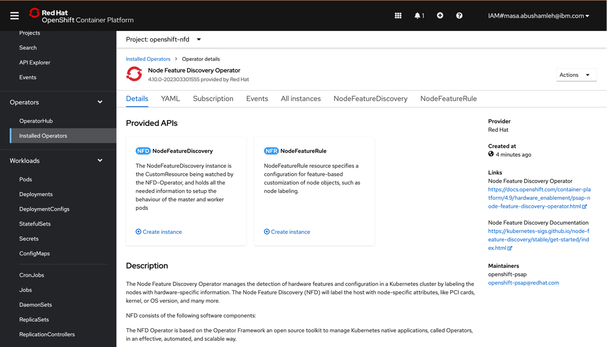</p>

- Keep the default settings as is and click create
<p>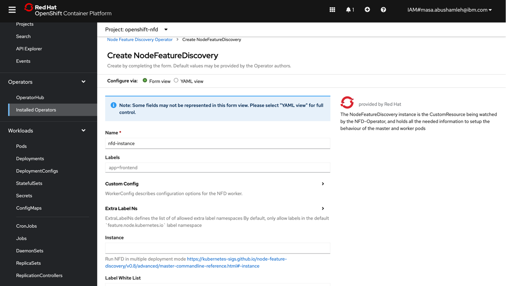</p>


- Note that 0x10de is the PCI vendor ID that is assigned to NVIDIA. Verify the GPU device pci-10de is discovered on the GPU node:
```
oc describe node | egrep 'Roles|pci' | grep -v master
                    feature.node.kubernetes.io/pci-10de.present=true
```

## Install and Set up NVIDIA GPU Operator
- Install Nvidia GPU Operator from OperatorHub. You can keep the default settings. A new namespace ```nvidia-gpu-operator``` is created along with the workloads installed by the operator.
<p>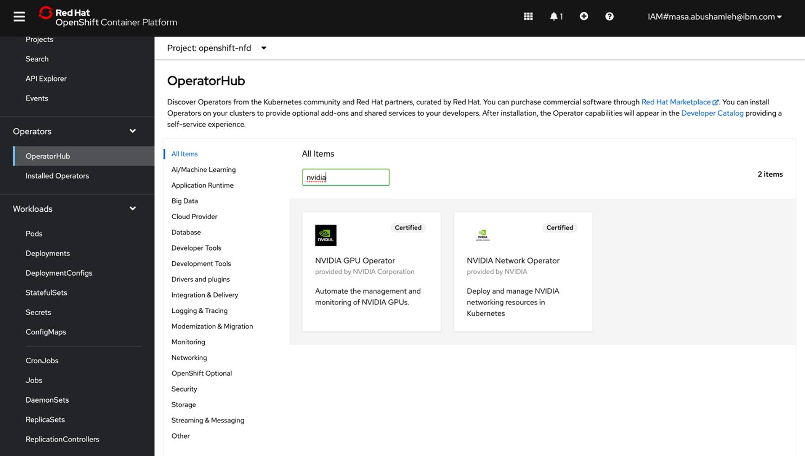</p>
<p>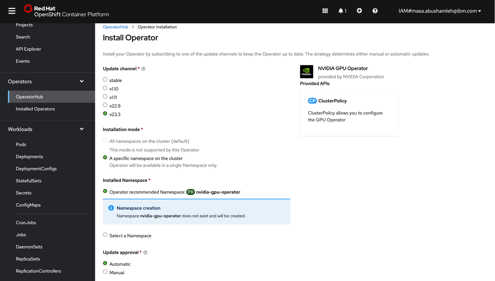</p>

- Create an instance of ClusterPolicy. Keep the default settings.
<p>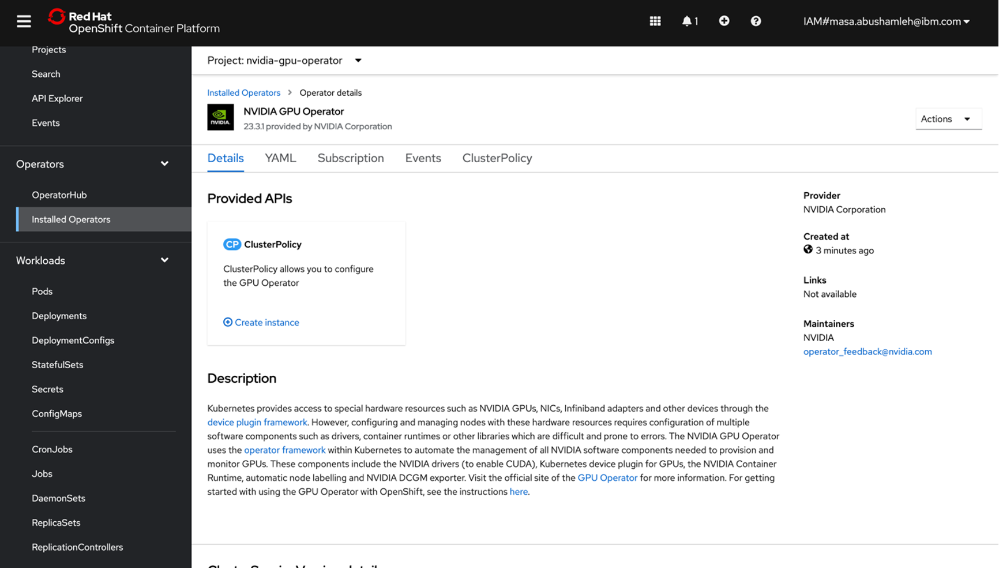</p>
<p>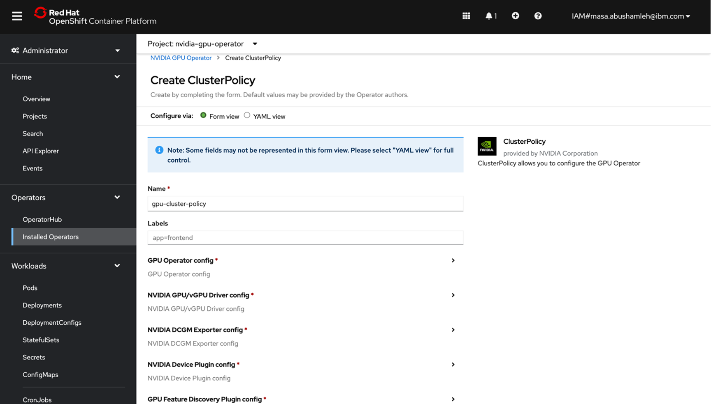</p>

- Once created, you should be able to see all pods in running and completed state.
<p>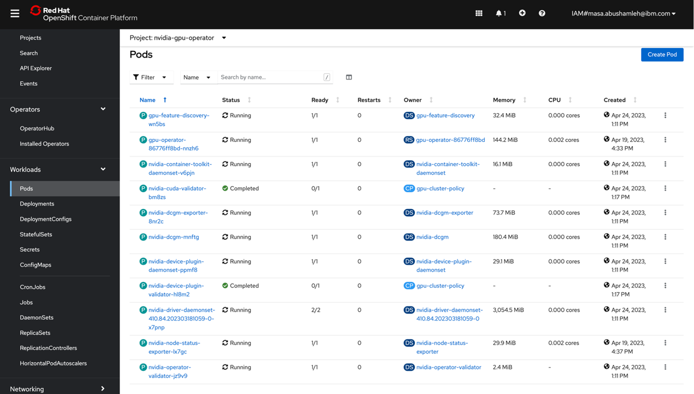</p>

### Appendix A - Fix Failing Install of GPU Operator
> **Note**
> Due to this bug the gpu operator fails to install: https://github.com/NVIDIA/gpu-operator/issues/428. The following steps are only required if the installation of the GPU operator fails.
- To fix this we need to create a new tag using this template:

```
oc -n openshift tag <copy from release.txt> driver-toolkit:<coreos machine version>
```

- Get the tag (machine version) with the following command
```bash
oc get nodes -o json | grep osImage
```
Example output
```
[48] root@Satellite Deployer:/ # oc get nodes -o json | grep osImage
                    "osImage": "Red Hat Enterprise Linux CoreOS 410.84.202304042113-0 (Ootpa)",
                    "osImage": "Red Hat Enterprise Linux CoreOS 410.84.202304042113-0 (Ootpa)",
                    "osImage": "Red Hat Enterprise Linux CoreOS 410.84.202304042113-0 (Ootpa)",
```
In this case the machione version is ```410.84.202304042113-0```

- Get the Openshift version
```bash
oc get nodes -o json | grep version
```
Example output
```
[49] root@Satellite Deployer:/ # oc get nodes -o json | grep version
                    "ibm-cloud.kubernetes.io/worker-version": "4.10.57_1565_openshift",
                    "ibm-cloud.kubernetes.io/worker-version": "4.10.57_1565_openshift",
                    "ibm-cloud.kubernetes.io/worker-version": "4.10.57_1565_openshift",
                    "ibm-cloud.kubernetes.io/worker-version": "4.10.57_1565_openshift",
                    "ibm-cloud.kubernetes.io/worker-version": "4.10.57_1565_openshift",
                    "ibm-cloud.kubernetes.io/worker-version": "4.10.57_1565_openshift",
```

In this case the version is ```4.10.57```

- The image name and hash can be found in realease.txt of OCP clients (here for version 4.10.57):

https://mirror.openshift.com/pub/openshift-v4/x86_64/clients/ocp/4.10.57/release.txt

- Check that machine os version (approximately line 20) matches our tag. If this is not the case, go to an earlier
or later version.
Find image for driver-toolkit, i.e. 
quay.io/openshift-release-dev/ocp-v4.0-art-dev@sha256:51e2043014581f30f456f54aacd983b6736b3a7d83c171ed7e0f78d3c13b550e

- Complete the command, i.e.
```
oc -n openshift tag quay.io/openshift-release-dev/ocp-v4.0-art-dev@sha256:51e2043014581f30f456f54aacd983b6736b3a7d83c171ed7e0f78d3c13b550e driver-toolkit:410.84.202303181059-0
```
- Execute the command. Then delete the pod nvidia-driver-daemonset-xxx-. It will get recreated and the driver will install.
- Verify that all pods are running:
```
[35] root@Satellite Deployer:/ # oc get pod -n nvidia-gpu-operator
NAME                                                  READY   STATUS      RESTARTS   AGE
gpu-feature-discovery-c7vmv                           1/1     Running     0          5h15m
gpu-operator-6bc8c5bcf6-rjwq8                         1/1     Running     0          5h37m
nvidia-container-toolkit-daemonset-pdcw5              1/1     Running     0          5h15m
nvidia-cuda-validator-kgpkj                           0/1     Completed   0          5h11m
nvidia-dcgm-exporter-ggzcr                            1/1     Running     0          5h15m
nvidia-dcgm-ns7j9                                     1/1     Running     0          5h15m
nvidia-device-plugin-daemonset-dmwm4                  1/1     Running     0          5h15m
nvidia-device-plugin-validator-4h2nl                  0/1     Completed   0          5h10m
nvidia-driver-daemonset-410.84.202303181059-0-mcg6m   2/2     Running     0          5h16m
nvidia-node-status-exporter-hxs2n                     1/1     Running     0          5h36m
nvidia-operator-validator-b59gb                       1/1     Running     0          5h15m
```

### Resources
- <a href="https://docs.nvidia.com/datacenter/cloud-native/gpu-operator/openshift/install-nfd.html">Installing the NFD Operator - NVIDIA Documentation</a>
- <a href="https://docs.nvidia.com/datacenter/cloud-native/gpu-operator/openshift/install-gpu-ocp.html">Installing the NVIDIA GPU Operator</a>
