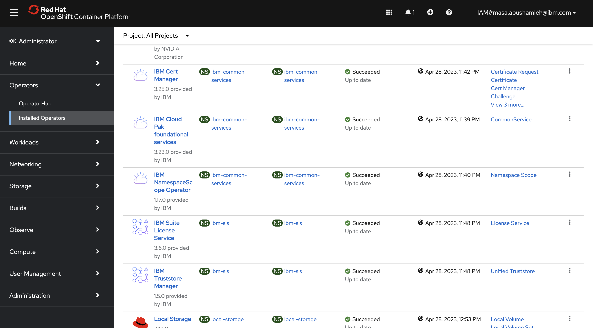
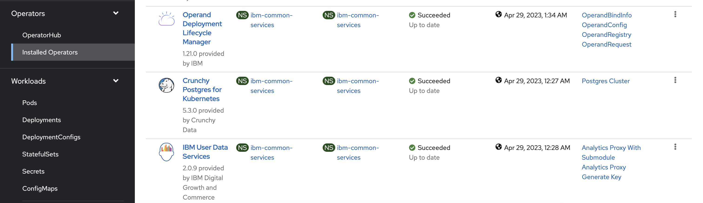
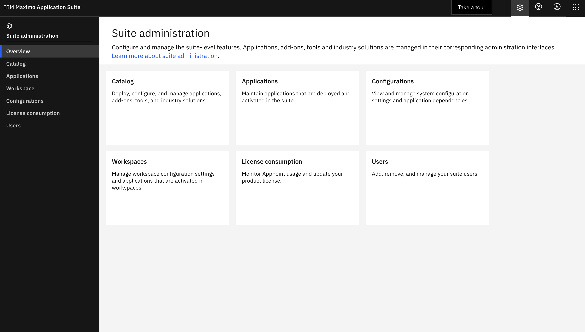
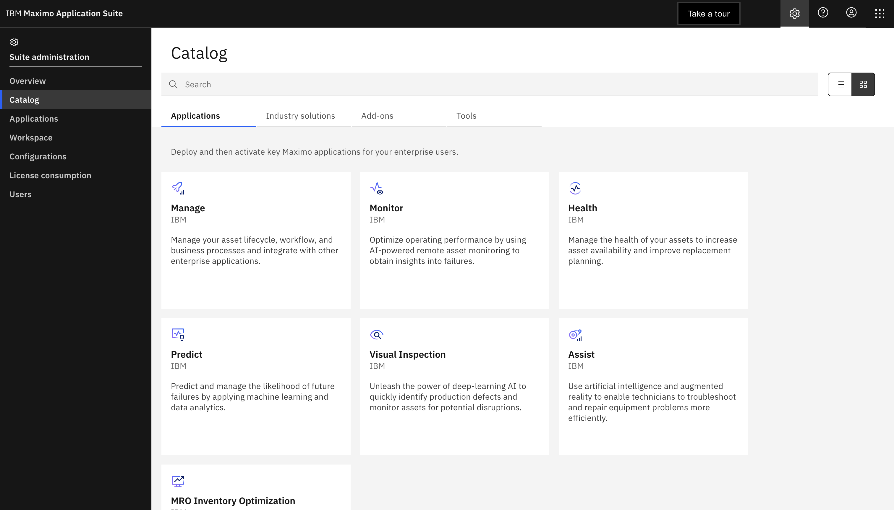

# Maximo Application Suite
This section describes the planning and installation of maximo application suite on Red Hat OpenShift.
## Requirements & Capacity Planning
You can use the IBM® Maximo® Application Suite sizing calculator to estimate the required sizing. Visit the <a href="https://www.ibm.com/docs/en/mas-cd/continuous-delivery?topic=planning-requirements-capacity">official documentation</a> for up to date information on capacity and planning.
<br>The current environment in this tutorial is for PoC and testing purposes. However, you can reuse and customize maximo installation steps for your environment.
## Software Requirements
In this tutorial, software requirements are installed as part of the automation in step 7 before installing the core application.<br>
To run any MAS application you need several prerequisites. This section covers the basic prerequisites for any MAS application. In ```mvi.md``` file, you will explore more on MVI specific requirements.<br>
Before installing Maximo Application Suite Core, you need to install and set up the following Services:
- IBM Certificate Manager
- User Data Services (UDS)
- IBM Suite License Service
- MongoDB

Once these services are installed, you can view their status and the resources created by exploring them from the Installed Operators page on Red Hat OpenShift web console.
<p></p>
<p></p>

In addition to that you can install some other optional services that can be used by Maximo Application Suite if they are present. You can view the <a href="https://www.ibm.com/docs/en/mas-cd/continuous-delivery?topic=overview-prerequisite-software">Prerequisites Software</a> page on the official documentation to view the application-specific prerequisites.<br>

## Instance Requirements
```prerequisites.md``` demonstrates steps on setting up custom domain and DNS server for maximo application. You can follow the steps in that guide if you don't own a custom domain. When you set up the domain, you will use the

Maximo Application Suite requires:
- Instance name to identify the Maximo Application Suite Installation on the cluster
- Domain and DNS server to ensure that your domain name is connected to your Red Hat OpenShift cluster.
- workspace ID. 

<br>You can review the instance requirements <a href="https://www.ibm.com/docs/en/mas-cd/continuous-delivery?topic=requirements-instance">here</a>.<br>
## Install Maximo Core
Once you complete the prerequisites of Maximo Applications, you will install Maximo application Suite from OperatorHub. To choose the right version that meets specific application requirements, review <a href="https://www.ibm.com/docs/en/mas-cd/continuous-delivery?topic=planning-compatibility-matrix">maximo compatibility matrix</a>.<br>
For this tutorial, since you will install MVI 8.8 and MAS 8.10.
## Using Maximo Application Suite
Get the superuser credentials ```<instance-name>-credentials-superuser``` to login to the admin dashboard ```https://admin.<maximo-domain>```. Explore the suite adminstration page.<br>
<p></p>
You can install maximo applications from the catalog by choosing and reserving AppPoints from the license.
<p></p>

### Create Admin user
- Go to ```Administration``` > ```Users``` to create a new admin user (15 AppPoints) and fill in the details for the user like name, email and password.

- Create admin user

- Assign application and administration ```entitlements``` -> ```Premium```

- Save the credentials, logout of the super user and login with the new admin user created to confirm access to the platform.

