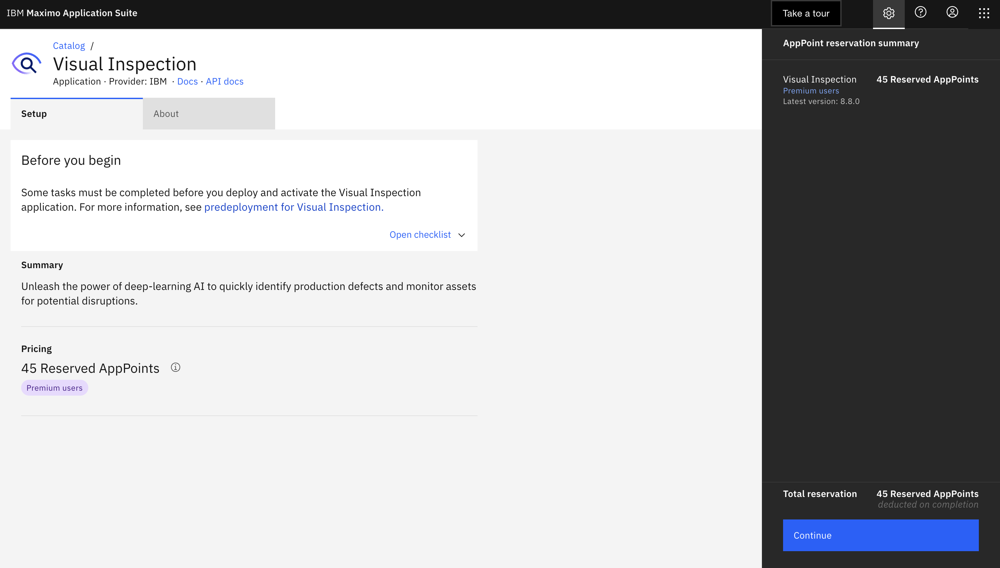
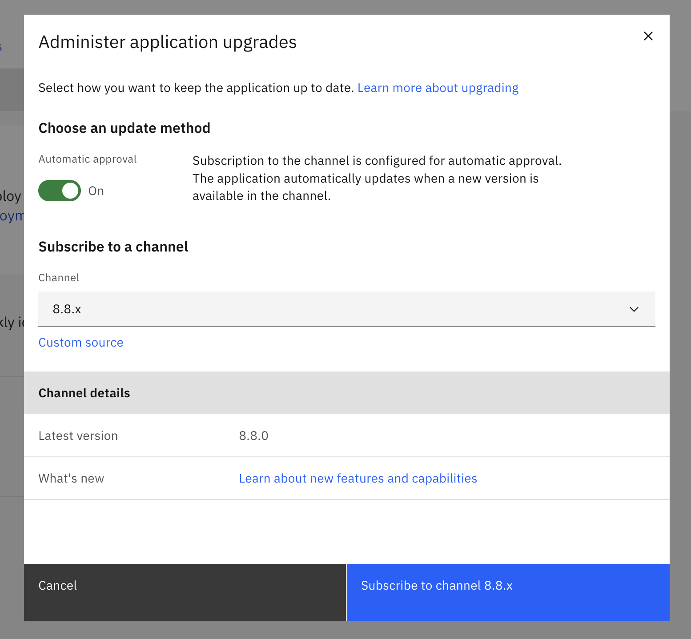
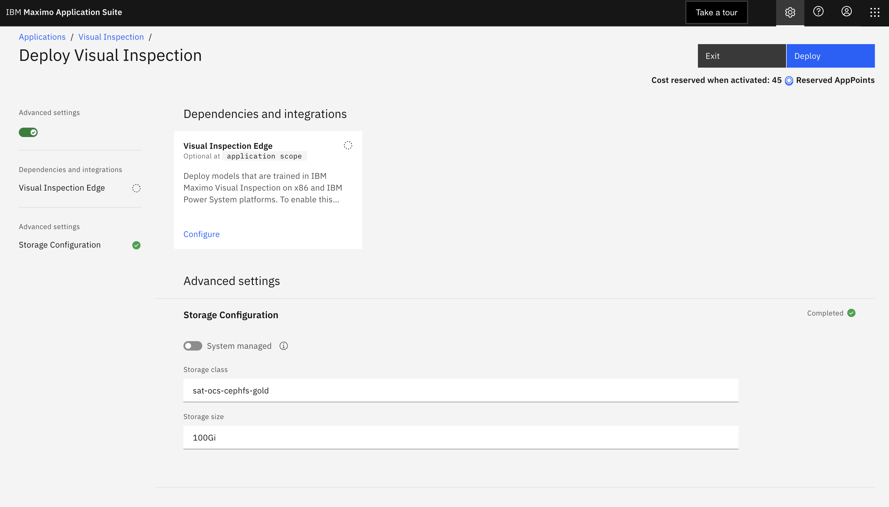
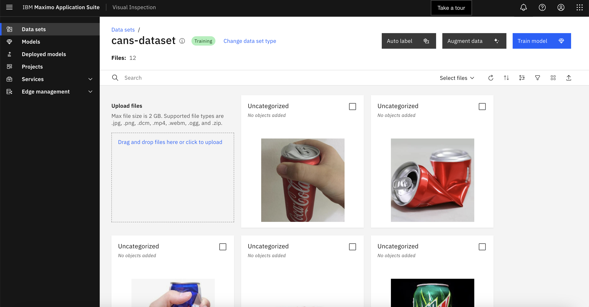
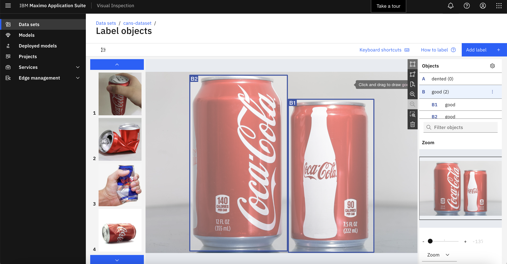
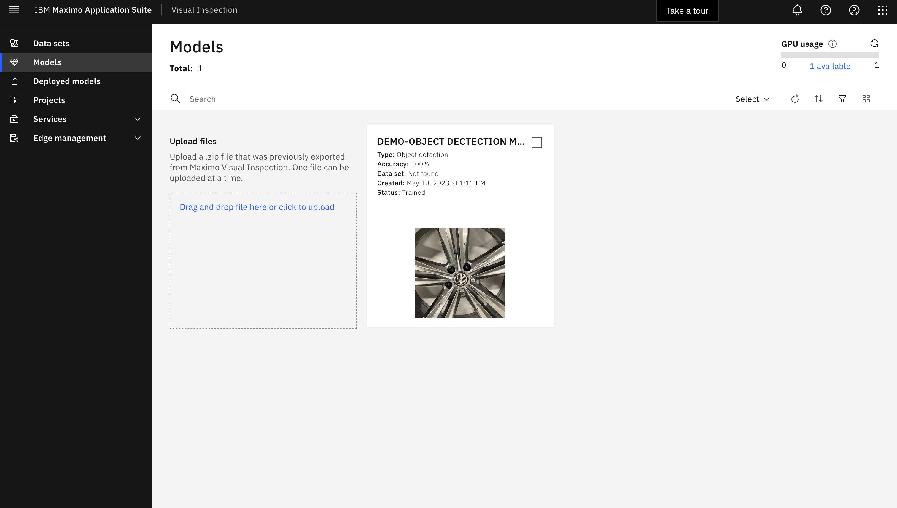
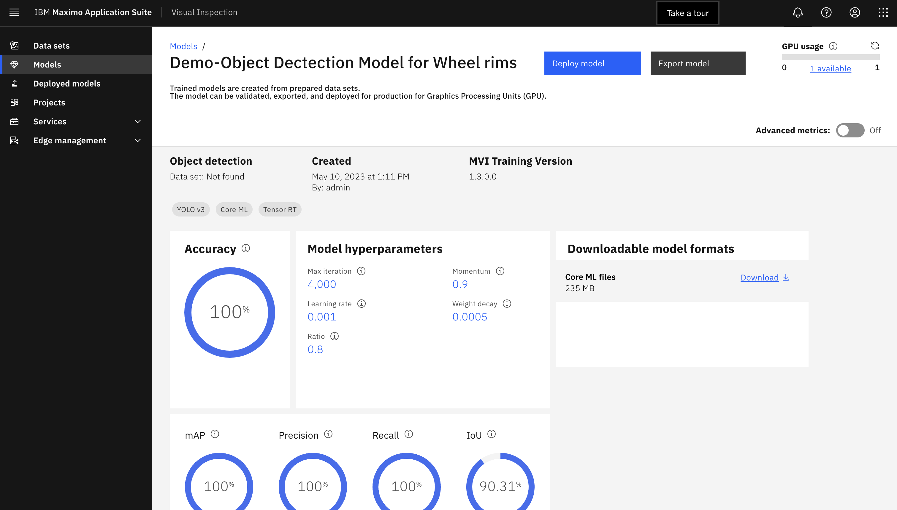
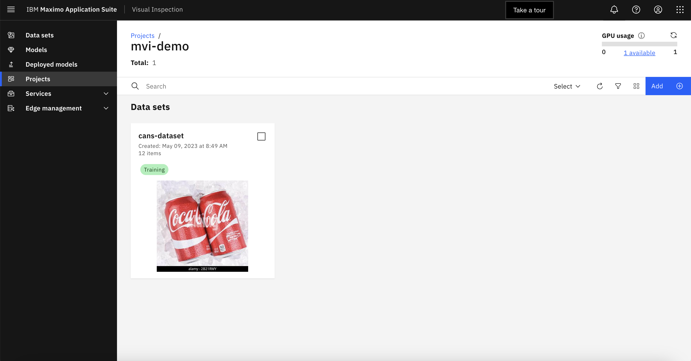

# Maximo Visual Inspection
This section describes the prepartion and installation of maximo visual inspection on Red Hat OpenShift.

## Requirements
Each Maximo Application has its own application-specific requirements. These requirements can be found in the <a href="https://www.ibm.com/docs/en/mas-cd/continuous-delivery?topic=requirements-maximo-visual-inspection">official documentation</a>. When you are planning for your MVI deployment, make sure to review the <a href="https://www.ibm.com/docs/en/maximo-vi/continuous-delivery?topic=planning">planning page</a>.
## Install MVI
Installation of MVI runs in the automation in step 8. This section shows an overview of manually installing MVI.
- From the catalog on maximo application suite, click Visual Inspection.
<p></p>

- Click on continue. Installing MVI reserves 45 AppPoints.
<p></p>

- Review the details of the installation, specify the correct version of MVI to install. Since MAS 8.10 is installed, you will install MVI 8.8.
<p align="center"></p>

- Set up the configurations for MVI. Click on advanced settings to review the storage configurations, since the installation is on IBM Cloud Satellite and the storage installed on the cluster, you can go with ```sat-ocs-cephfs-gold``` storage class.
<p></p>

## Using Maximo Visual Inspection
To learn how to use maximo visual inspection, follow the steps in the exercises section in MVI Labs which demonstrates the following steps:
- <a href="https://mam-hol.eu-gb.mybluemix.net/mvi_saas/exerciseOne/exercise1-1/">Create data set</a>
- <a href="https://mam-hol.eu-gb.mybluemix.net/mvi_saas/exerciseOne/exercise1-2/">Train and deploy model</a>
- <a href="https://mam-hol.eu-gb.mybluemix.net/mvi_saas/exerciseOne/exercise1-3/">Create project</a>

The following sections give an overview of the platform.
#### Data sets
In the data sets page, you create your data sets, label them and prepare them before using them to train a model.
<p></p>
<p></p>

#### Model
With MVI, you can train from datasets, deploy, validate and export new and existing models to use them for production. You can also view details about the models and training and optimization types.
<p></p>
<p></p>

#### Project
You can use projects to group your project components such as data sets and training models in one place.
<p></p>

## Resources
- <a href="https://www.ibm.com/docs/en/maximo-vi/continuous-delivery?topic=getting-started">Getting Started with MVI</a>.
- <a href="https://www.ibm.com/docs/en/SSRU69_cd/base/vision_create_dataset.html">Creating and working with data sets</a>.
- <a href="https://www.ibm.com/docs/en/SSRU69_cd/base/vision_train_settings.html">Settings for training models</a>.
