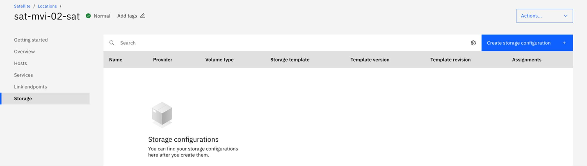
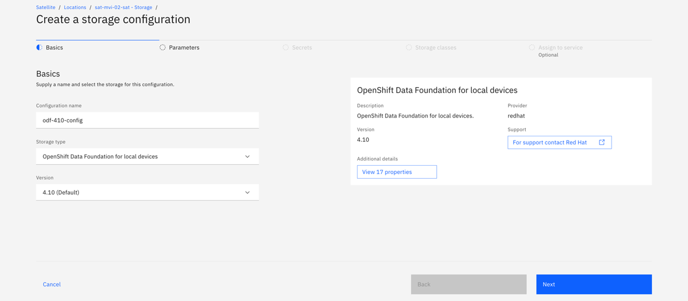
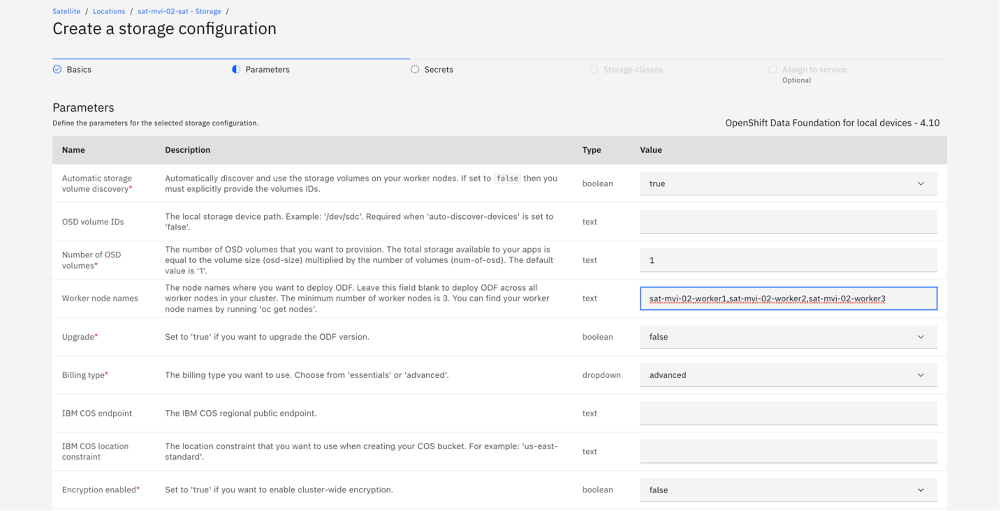
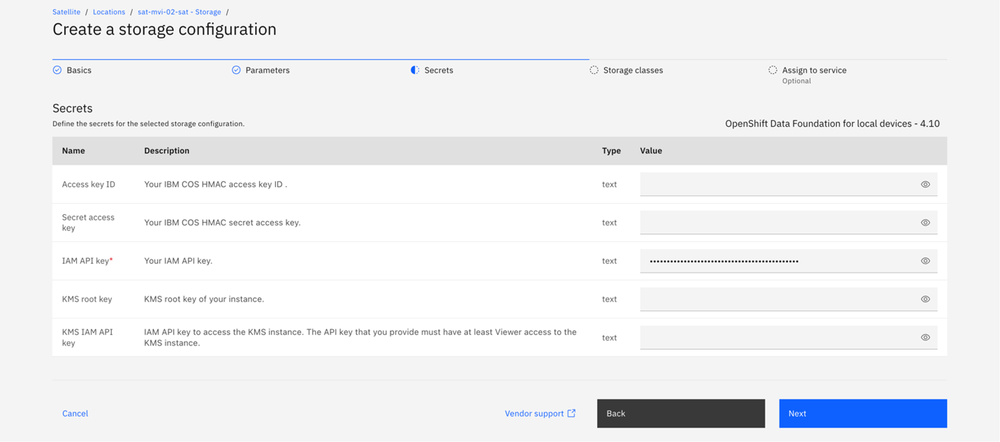
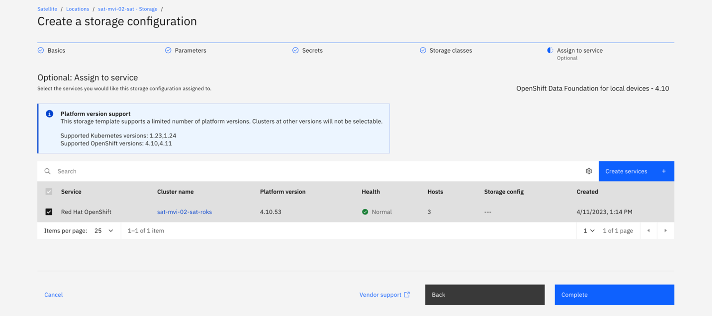
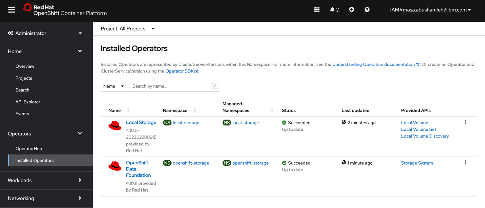
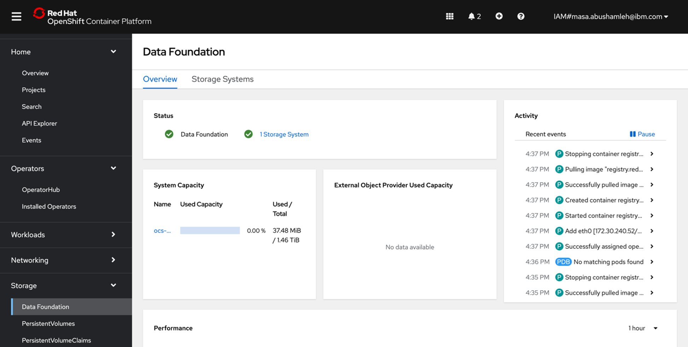
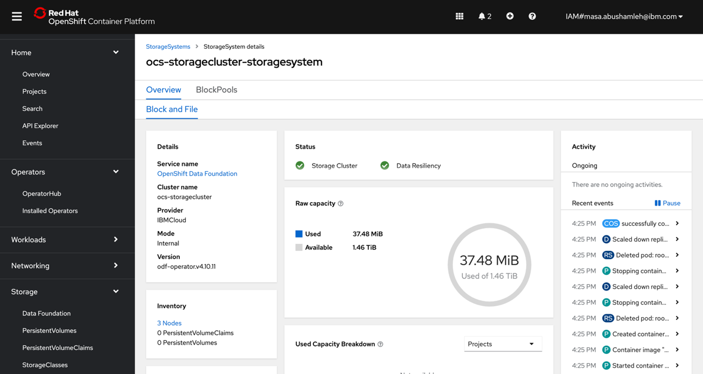
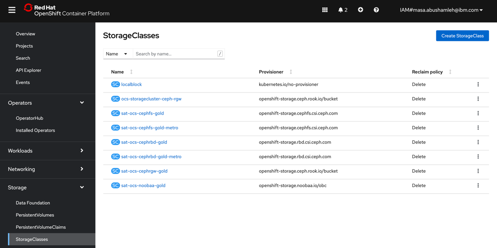
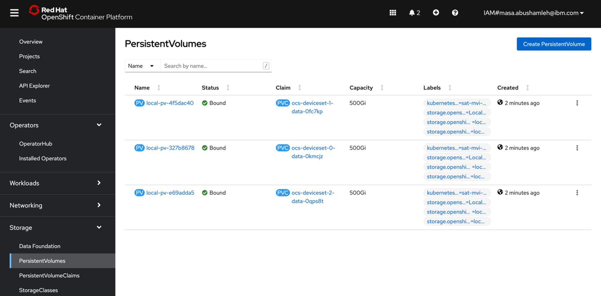

## Set up ODF through the console
This section shows steps to manually set up ODF using the console. In this step, you will set up ODF using local disks, but first make sure to satisfy the prerequisites for ODF.
### Prerequisites
To use the ODF storage with the local storage operator and local storage devices, complete the following tasks:
1. Make sure you have the following permissions.
    - Editor for the Billing service.
    - Manager and Editor for Kubernetes service.
    - Satellite Link Administrator and Reader for the Satellite service.
2. Satellite cluster
    - Make sure that you select the Enable cluster admin access for Satellite Config option when you create the cluster. If you don't enable Administrator (admin) access for Satellite Config when creating your cluster, you must re-create your cluster and enable admin access before you can deploy storage.
To learn more about ODF using local disks, refer to the <a href="https://cloud.ibm.com/docs/satellite?topic=satellite-storage-odf-local&interface=ui">official documentation.</a>

### Steps
You can create storage configuration on IBM Cloud Satellite through the UI, CLI, or API. The steps documented here will be using the UI.
-	From the Satellite console, go to ```Storage``` and click Create storage configuration.
<p></p>

- Give the configuration a name, select storage type ```OpenShift Data Foundation for local devices``` and choose the same version as the OpenShift cluster created earlier.
<p></p>

- Most of the parameters can remain as default. Make sure to add the Worker node names correctly, node names are divided by comma, no white spaces. You can set Ignore Noobaa to ```true```, then click next.
<p></p>

- Add IAM API key 
<p></p>

- Assign the configuration to the red hat openshift cluster you created earlier.
<p></p>

- You can review the status of ODF storage as shown in the screenshots.
<p></p>
<p></p>
<p></p>
<p></p>
<p></p>

- You can also review the status of ODF using the cli.
```
oc get storagecluster -n openshift-storage
NAME                 AGE   PHASE   EXTERNAL   CREATED AT             VERSION
ocs-storagecluster   23m   Ready              2023-04-11T12:22:14Z   4.10.0
```
```
oc get sc

NAME                          PROVISIONER                             RECLAIMPOLICY   VOLUMEBINDINGMODE      ALLOWVOLUMEEXPANSION   AGE
localblock                    kubernetes.io/no-provisioner            Delete          WaitForFirstConsumer   false                  23m
ocs-storagecluster-ceph-rbd   openshift-storage.rbd.csi.ceph.com      Delete          Immediate              true                   18m
ocs-storagecluster-ceph-rgw   openshift-storage.ceph.rook.io/bucket   Delete          Immediate              false                  22m
ocs-storagecluster-cephfs     openshift-storage.cephfs.csi.ceph.com   Delete          Immediate              true                   18m
sat-ocs-cephfs-gold           openshift-storage.cephfs.csi.ceph.com   Delete          Immediate              true                   24m
sat-ocs-cephfs-gold-metro     openshift-storage.cephfs.csi.ceph.com   Delete          WaitForFirstConsumer   true                   24m
sat-ocs-cephrbd-gold          openshift-storage.rbd.csi.ceph.com      Delete          Immediate              true                   24m
sat-ocs-cephrbd-gold-metro    openshift-storage.rbd.csi.ceph.com      Delete          WaitForFirstConsumer   true                   24m
sat-ocs-cephrgw-gold          openshift-storage.ceph.rook.io/bucket   Delete          Immediate              false                  24m
sat-ocs-noobaa-gold           openshift-storage.noobaa.io/obc         Delete          Immediate              false                  24m
```

```
oc get pv
NAME                CAPACITY   ACCESS MODES   RECLAIM POLICY   STATUS   CLAIM                                           STORAGECLASS   REASON   AGE
local-pv-327b8678   500Gi      RWO            Delete           Bound    openshift-storage/ocs-deviceset-0-data-0kmcjz   localblock              22m
local-pv-4f5dac40   500Gi      RWO            Delete           Bound    openshift-storage/ocs-deviceset-1-data-0fc7kp   localblock              22m
local-pv-e69adda5   500Gi      RWO            Delete           Bound    openshift-storage/ocs-deviceset-2-data-0qps8t   localblock              22m
```

```
oc get pvc -n openshift-storage
NAME                          STATUS   VOLUME              CAPACITY   ACCESS MODES   STORAGECLASS   AGE
ocs-deviceset-0-data-0kmcjz   Bound    local-pv-327b8678   500Gi      RWO            localblock     20m
ocs-deviceset-1-data-0fc7kp   Bound    local-pv-4f5dac40   500Gi      RWO            localblock     20m
ocs-deviceset-2-data-0qps8t   Bound    local-pv-e69adda5   500Gi      RWO            localblock     20m
```
